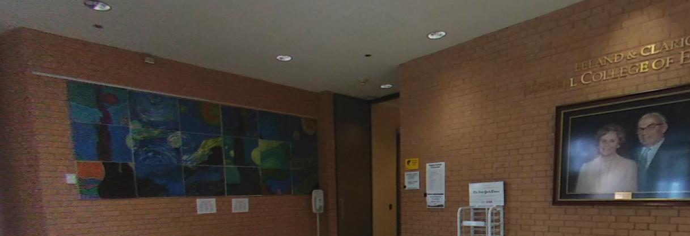
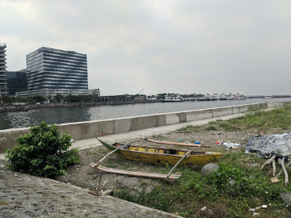

# OSINT questions

## Q1 (Difficulty level 1)
Initial Information:  
KSU recently won a major cyber competition. One of our team members was a big fan of three video games and was caught on camera. In alphabetical order, what are those three games?

Hint:  None given for this question

Answer:
Hearthstone, League of Legends, Path of Exile

## Q2 (Difficulty level 2)
Initial Information:  
There's a very nice picture that we have here. What’s the street address for the building in which it was taken as listed on its website?
 

Hint:  None given for this question

Answer:
580 Parliament Garden Way, NW

## Q3 (Difficulty level 3)
Initial Information:  
One of our organizers (who's a big fan of Alabama and drumming) publishes quite a few academic papers. What's the publish date for their oldest paper? (YYYY/MM/DD format)

Hint:  None given for this question

Answer:
2007/09/28

## Q4 (Difficulty level 4)
Initial Information:  
In the lovely town of Mobridge, SD there's one WiFi Access Point with the SSID "TSOYK". What's the BSSID associated with that Access Point?

Hint:  None given for this question

Answer:
cc:be:59:79:5d:1f

## Q5 (Difficulty level 5)
Initial Information:  
Nice photo. What's the PlusCode of that giant building over there?  

Hint:  None given for this question

Answer:
GXRJ+GV Pasay, Metro Manila, Philippines
